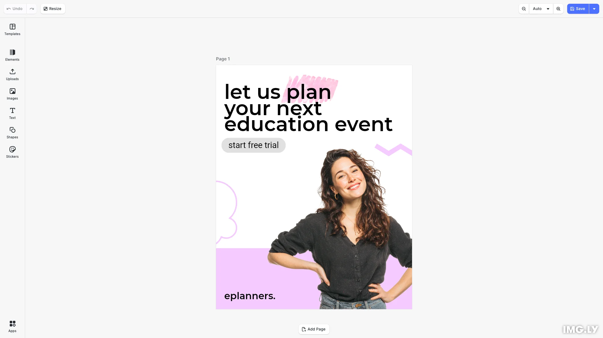

# Photo Translate Demo

Translate the text inside a photograph using IMG.LY's CE.SDK + the IMG.LY
AI Gateway. Upload an image, click Continue, pick languages, get one new
page per translation — all in the browser.

<p>
  <a href="https://img.ly/docs/cesdk/js/starterkits/photo-editor-fp8h8a/">Photo Editor docs</a>
</p>



## Getting Started

### Clone the Repository

```bash
git clone https://github.com/imgly/starterkit-design-editor-ts-web.git
cd starterkit-design-editor-ts-web
```

### Install Dependencies

```bash
npm install
```

### Download Assets

CE.SDK requires engine assets (fonts, icons, UI elements) served from your `public/` directory.

```bash
curl -O https://cdn.img.ly/packages/imgly/cesdk-js/$UBQ_VERSION$/imgly-assets.zip
unzip imgly-assets.zip -d public/
rm imgly-assets.zip
```

### Run the Development Server

```bash
npm run dev
```

Open `http://localhost:5173` in your browser.

## Configuration

### Theming

```typescript
cesdk.ui.setTheme('dark'); // 'light' | 'dark' | 'system'
```

See [Theming](https://img.ly/docs/cesdk/web/ui-styling/theming/) for custom color schemes and styling.

### Localization

```typescript
cesdk.i18n.setTranslations({
  de: { 'common.save': 'Speichern' }
});
cesdk.i18n.setLocale('de');
```

See [Localization](https://img.ly/docs/cesdk/web/ui-styling/localization/) for supported languages and translation keys.

## Architecture

```
photo-translate-demo/
├── src/
│   ├── index.ts                          # State machine + editor bootstrap
│   └── imgly/
│       ├── index.ts                      # initPhotoEditor
│       └── plugins/
│           ├── background-removal.ts
│           ├── translate/                # Translate dock entry + panel
│           └── upload/                   # Pre-editor upload screen
├── photo-editor/                         # Photo Editor config (dock, nav, features)
├── public/                               # Static assets
├── package.json
└── vite.config.ts
```

## Prerequisites

- **Node.js v20+** with npm – [Download](https://nodejs.org/)
- **Supported browsers** – Chrome 114+, Edge 114+, Firefox 115+, Safari 15.6+

## Troubleshooting

| Issue | Solution |
|-------|----------|
| Editor doesn't load | Verify assets are accessible at `baseURL` |
| Assets don't appear | Check `public/assets/` directory exists |
| Watermark appears | Add your license key |

## How translation works

The demo opens to a small upload screen (the editor is *not* the entry
point). Drop a photo that contains text, click **Continue to editor**, and
the photo opens in a Photo Editor UI with the Translate panel pre-opened
and the image pre-selected.

The dock contains exactly two entries: **Translate** and **Uploads**.

### Models

The Translate panel offers three image-edit models routed through the
IMG.LY AI Gateway:

| Model           | Gateway id                       |
|-----------------|----------------------------------|
| Nano Banana Pro | `google/nano-banana-pro-edit`    |
| GPT Image 2     | `openai/gpt-image-2-edit`        |
| Seedream 4.5    | `bytedance/seedream-4.5-edit`    |

The list is hard-coded in `src/imgly/plugins/translate/providers.ts`. To
change it, edit `TRANSLATE_MODELS`.

### Configuration

1. Copy `.env.example` to `.env` and set `VITE_AI_API_KEY` to a key from the
   [IMG.LY dashboard](https://img.ly/dashboard). (Optional:
   `VITE_AI_GATEWAY_URL` to point at a non-production gateway.)
2. Restart the dev server.

If `VITE_AI_API_KEY` is unset, the app shows an onboarding screen instead
of the upload screen.

The starter forwards the key to the gateway via `{ dangerouslyExposeApiKey }`
— exposed to anyone with DevTools access. **This is intentional for local
development only.** In production, return a short-lived JWT minted by your
backend from the `ly.img.ai.getToken` action handler instead.

### Using it

1. Drop or pick a photo with text on the upload screen.
2. Click **Continue to editor**. The photo opens with the Translate panel
   already open and the image already selected.
3. Pick a model (default: Nano Banana Pro). Check one or more target
   languages (German, English, Spanish, Russian, Chinese).
4. Click **Translate**. One new page per checked language is appended,
   each containing the photo with its text translated. The whole batch is
   one undo step.

Use the **Back** button in the top-left of the navigation bar to return to
the upload screen. Edits to the current scene are discarded — like a page
reload.

## Documentation

For complete integration guides and API reference, visit the [Photo Editor Documentation](https://img.ly/docs/cesdk/starterkits/photo-editor/).

## License

This project is licensed under the MIT License - see the [LICENSE](LICENSE) file for details.

---

<p align="center">Built with <a href="https://img.ly/creative-sdk?utm_source=github&utm_medium=project&utm_campaign=starterkit-photo-translate">CE.SDK</a> by <a href="https://img.ly?utm_source=github&utm_medium=project&utm_campaign=starterkit-photo-translate">IMG.LY</a></p>
